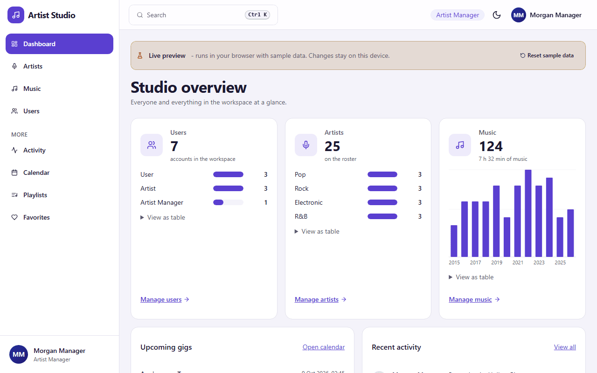
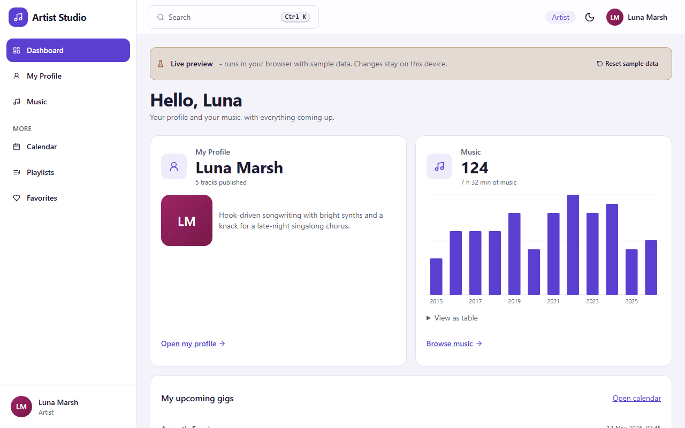
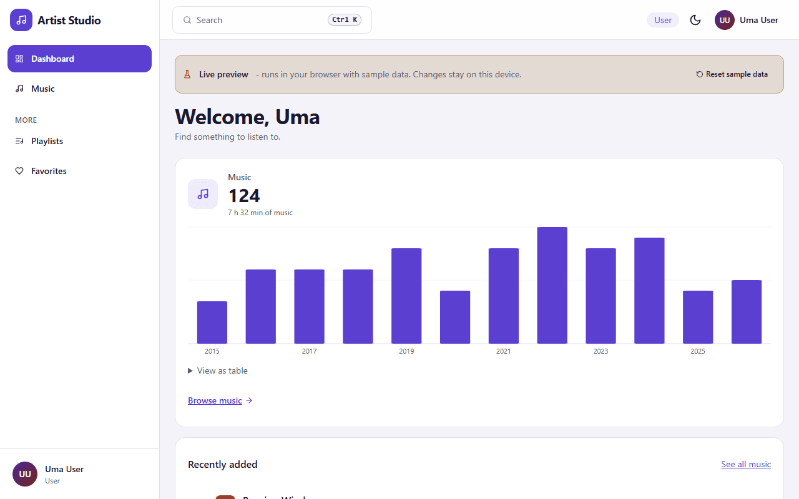

# Artist Management System

Artist, music and booking management with three role based workspaces, analytics, playlists, audio previews and an audit trail.

**Live preview (runs entirely in your browser with sample data): https://shishir19999.github.io/Artist-Management-System/**

| Artist Manager | Artist | User |
| --- | --- | --- |
|  |  |  |

More screenshots (landing page, sign in, music table, phone layout) are in [docs/screenshots](docs/screenshots).

## Roles

The Artist Manager is the top role. Every role gets its own dashboard, its own menu (nothing is listed that the role cannot open) and its own wording. Opening a page that is not part of a role's workspace shows a friendly "Not available for your role" page with a **Go back** button, in the real app and in the preview.

| | Artist Manager | Artist | User |
| --- | --- | --- | --- |
| Who | Runs the workspace | The musician | A listener |
| Dashboard | 3 cards: Users, Artists, Music, plus gigs and recent activity | 2 cards: My Profile, Music, plus own gigs | 1 full-width card: Music, plus recently added tracks |
| Menu | Dashboard, Artists, Music, Users. More: Activity, Calendar, Playlists, Favorites | Dashboard, My Profile, Music. More: Calendar, Playlists, Favorites | Dashboard, Music. More: Playlists, Favorites |
| Users | Create, edit, delete, assign any role (the only place roles change) | - (API returns 403) | - (API returns 403) |
| Artists | Create, edit, delete every artist | Read all artists (public details only for others); edit own linked artist profile only; no create or delete | - (API returns 403) |
| Music | Create, edit, delete everything, CSV import and export | Browse everything; create, edit and delete music of own artist only | Browse everything, read only |
| Calendar and gigs | All artists, full control | Read-only, gigs of own artist | - (API returns 403) |
| Playlists | Own playlists only | Own playlists only | Own playlists only |
| Favorites | Own favorites only | Own favorites only (songs and artists) | Own favorites only (songs only) |
| Activity trail | Everything | - (API returns 403) | - (API returns 403) |
| Own account (`/api/me`) | Edit name, phone, address, gender, birth date, password (current password required) | Same | Same |
| Registration | Cannot self register | Can self register (gets an empty artist profile to fill in) | Can self register |

Public sign up (`/auth/register`) asks for name, email, password, phone, address, gender and date of birth, and offers only **User** and **Artist** as the role. An Artist Manager account can only be created by another manager, or by the seed script.

Every role may edit only its own profile fields; the role and the e-mail can never be changed there. Playlists and favorites are always limited to the signed in user's own rows. Unauthenticated API calls get 401, a wrong role 403, and pages outside a role's workspace redirect to the not-allowed page.

The screen rules live in `src/lib/client/role-policy.ts` (menu, page access, row ownership). The real server enforces its own rules in every route handler and in `src/proxy.ts`; the browser-only preview implements the same rules in `src/lib/demo`.

## Architecture: real app and live preview

There are two ways to run the same user interface.

| | Real app (`npm run dev` / `npm run build`) | Live preview (`npm run build:pages`) |
| --- | --- | --- |
| Data | MariaDB or MySQL through Prisma | Browser storage, seeded with 26 artists and about 120 tracks |
| Auth | NextAuth (credentials and optional Google), JWT sessions, role checks in `src/proxy.ts` and every route handler | A session kept in the browser, same role rules |
| API | Next.js route handlers in `src/app/api` | An in-browser implementation of the same endpoints (`src/lib/demo`) |
| Hosting | Node server or Docker | Any static host, for example GitHub Pages |

GitHub Pages only serves static files, so it cannot run a database or a login server. The website is therefore a live preview: the interface is exported as a static site and talks to a small in-browser API with sample data. Nothing leaves your device, your changes stay in this browser, and **Reset sample data** in the banner restores the sample catalogue. To work with real data and real accounts, run the real app.

How the preview is built: `scripts/build-pages.mjs` copies the sources into `.pages-build/`, removes the server code (API routes, proxy, NextAuth, Prisma), replaces each `*.demo.tsx` file by its server-backed counterpart, turns dynamic detail routes into `?id=` pages and exports a static site with the base path `/Artist-Management-System`. The real source tree is never modified.

```
src/
  app/            routes: landing, /auth, /admin pages, /api (real app only)
  components/     shell (menu, header, tour), tables, dialogs, charts, player
  features/       one folder per area: dashboard, artists, music, users, calendar, playlists
  lib/client/     hooks, routes, role-policy, auth (real and preview versions)
  lib/demo/       the in-browser API, access rules and sample data
  lib/domain/     types, schemas and helpers shared by both modes
```

## Preview accounts

All sample accounts use the password `Demo@1234`. The sign in page of the preview has a collapsed **Preview accounts** helper whose **Fill form** buttons only fill the fields; you still press **Sign in**.

| Role | Email |
| --- | --- |
| Artist Manager | `manager@example.com` |
| Artist | `artist@example.com` |
| User | `user@example.com` |

## Features

- A dashboard per role, with counts, small charts, upcoming gigs and activity
- Global search (Ctrl+K or /), sortable, filterable, paginated tables with column choice, CSV export and import, bulk actions
- Artist profiles with biography, photo, social links, discography and bookings; month calendar for gigs
- Music with duration, genre, release date, cover art and in-app previews (synthesised clips, no audio files)
- Playlists, favorites and an audit trail of every change
- A short optional tour: a small card offers it after sign in, it can be dismissed for good and replayed from the account menu
- Light and dark theme, responsive from 320 px with a phone menu, keyboard and screen reader friendly (skip link, visible focus, Escape closes menus and dialogs, labelled controls, announced form errors, reduced motion respected)

## Setup (real app)

1. `npm install`
2. Copy `.env.example` to `.env` and fill in the values (`DATABASE_URL`, `NEXTAUTH_SECRET`, `NEXTAUTH_URL`, optionally `GOOGLE_CLIENT_ID` and `GOOGLE_CLIENT_SECRET`).
3. `npx prisma migrate deploy` (or `npx prisma migrate dev` while developing) and `npx prisma generate`.
4. Set `SEED_MANAGER_EMAIL` and `SEED_MANAGER_PASSWORD` (at least 8 characters) and run `npx prisma db seed` to create the first Artist Manager. The seed is idempotent.
5. Optional sample data: also set `SEED_DEMO_PASSWORD` (at least 8 characters) before seeding to create demo accounts and a small catalogue (see `prisma/seed.ts`).
6. `npm run dev` and open http://localhost:3000

Any MySQL 8 or MariaDB 10.6+ works, for example `DATABASE_URL="mysql://root@127.0.0.1:3306/artist_db"` after `CREATE DATABASE artist_db;`.

| Seeded account | Email | Password |
| --- | --- | --- |
| Artist Manager | value of `SEED_MANAGER_EMAIL` | value of `SEED_MANAGER_PASSWORD` |
| Artist Manager (demo) | `manager@artist.local` | value of `SEED_DEMO_PASSWORD` |
| Artists (demo) | `aurora@artist.local`, `dusty@artist.local`, `neon@artist.local` | value of `SEED_DEMO_PASSWORD` |
| Users (demo) | `user@artist.local`, `listener@artist.local` | value of `SEED_DEMO_PASSWORD` |

## Scripts

| Command | What it does |
| --- | --- |
| `npm run dev` | Development server |
| `npm run build` / `npm start` | Production build and server |
| `npm run build:pages` | Static live preview into `dist-pages/` (serve it under `/Artist-Management-System/`) |
| `npm run lint` | ESLint |
| `npm test` | Vitest unit tests (role rules, preview API, schemas, authorization) |
| `npm run db:seed` | Seed the first Artist Manager and optional sample data |

To look at the static preview locally, serve `dist-pages` under the sub-path, for example by placing it in a folder named `Artist-Management-System` next to a small static server. `BASE_PATH=/other-name npm run build:pages` publishes it under another repository name. Publish the contents of `dist-pages/` (it contains `.nojekyll`) to the `gh-pages` branch or as a Pages artifact.

## Notes

- Authorization: `src/proxy.ts` gates `/admin/**` and `/api/**` (except `/api/auth/**`), and every route handler also calls `authorize()` from `src/lib/authz.ts`. Unauthenticated API calls get 401, a wrong role 403. Password hashes are never returned.
- Auth: NextAuth with credentials (bcrypt) and Google (optional, see [docs/GOOGLE_OAUTH.md](docs/GOOGLE_OAUTH.md)), JWT sessions, Prisma adapter. Google users are created as `USER`; an email that already exists under another sign in method is refused.
- Logout revocation: `User.tokenVersion` is stored in the JWT and re-checked against the database on every session read. It is incremented on logout and when a manager changes a user's password or role, so a copied old token returns 401.
- Public sign up is rate limited (10 requests per 15 minutes per IP, in memory, per instance).
- `/login` redirects to `/auth/login`. Pages live under `/admin`, sign in pages under `/auth`.

## Deployment (Docker)

Files: `Dockerfile` (multi-stage, Next.js `output: "standalone"`, non-root), `docker-compose.yml` (MariaDB, a one-shot `migrate` job and the app), `.dockerignore`, `.env.docker.example`.

```bash
cp .env.docker.example .env        # set DB_PASSWORD, DB_ROOT_PASSWORD, NEXTAUTH_SECRET, NEXTAUTH_URL, APP_PORT
docker compose up -d --build       # db -> migrate (prisma migrate deploy) -> app on http://localhost:${APP_PORT}

# seed the first Artist Manager (idempotent; add SEED_DEMO_PASSWORD for demo artists, users and sample data):
SEED_MANAGER_EMAIL=you@example.com SEED_MANAGER_PASSWORD=a-long-password SEED_DEMO_PASSWORD=another-long-one   docker compose --profile seed run --rm seed
```

`NEXTAUTH_URL` must be the exact origin you type in the browser (for example `http://localhost:3000`, or `http://localhost:29100` when `APP_PORT=29100`). To keep the database off the host, nothing publishes MariaDB; to reach it from the host add a compose override with `ports: ["3307:3306"]` for `db`. The `db` service starts MariaDB with `--lower-case-table-names=1` because the migration history mixes `User` and `user` spellings (it was written on Windows); this only takes effect on a fresh volume, so after changing it run `docker compose down -v` once. Stop and wipe everything with `docker compose down -v`.

Existing databases: the migration `20261008120000_roles_artist_manager` turns every `ADMIN` row into `ARTIST_MANAGER` (it first widens the enum, converts, then drops `ADMIN`), adds the optional `phone`, `address` and `birth_date` columns on users and the optional unique `Artist.userId` link used by the Artist role. Run `npx prisma migrate deploy` (the compose `migrate` job does it for you).

| Variable | Purpose |
| --- | --- |
| `DATABASE_URL` | MySQL or MariaDB URL (compose builds it from `DB_PASSWORD`) |
| `NEXTAUTH_SECRET` | JWT signing secret, required (`openssl rand -base64 32`) |
| `NEXTAUTH_URL` | Public URL of the site (https in production) |
| `GOOGLE_CLIENT_ID` / `GOOGLE_CLIENT_SECRET` | Optional; enable Google sign in |
| `SEED_*` | Only for `prisma db seed` |

Without Docker: `npm ci && npx prisma migrate deploy && npm run build`, then `node .next/standalone/server.js` (copy `public` and `.next/static` into the standalone folder) or `npm start`. Put a TLS terminating reverse proxy in front for production and make sure it sets `X-Forwarded-For` (used by the sign up rate limit).
